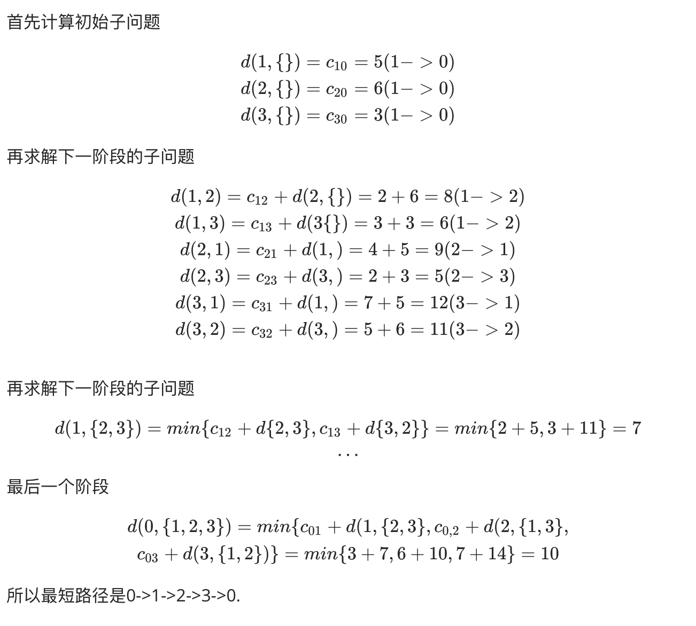
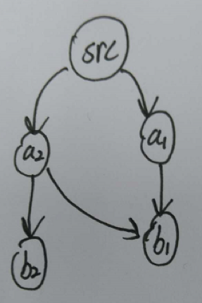
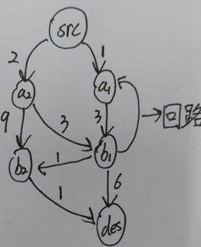
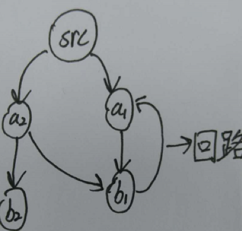
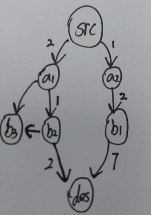

# 问题描述

广义旅行商问题：给定一个加权图G=(V, E,W)，其中图中的边上有权值（所有权值为正）。给定一个源顶点s，和一个目标顶点点t，以及一个包含k个顶点的查询集合Q={vi1,vi2,…,vik}，其中k<=5。要求设计一个动态规划算法计算从s到t并且经过集合Q中所有顶点的最短路径。

测试数据集来自于 http://snap.stanford.edu/data/roadNet-CA.html。

这个数据是加利福利亚州的公路网络，包含1,965,206个节点和2,766,607条边。

这个问题分为两部分，第一部分是理由动态规划求解GSTP问题。第二部分在有向有环加权图中求节点对的最短路径。

## 动态规划

### 1. 最优子结构

设s,s1,s2,….,sp是从s出发的一条路径长度最短的简单回路。假设s到s1的最短路径P1已经求出，问题转化为求从s1到sp的最短路径，显然s1,s2,…,sp,s一定构成一条从s1到s的最短回路，如若不然，设s1,r1,r2,…,rq,s是一条从s1到s的最短路径，且经过n-1个不同的城市，则s1,r1,r2,…,rq,s是从s出发的长度最短的简单回路比s,s1,s2,….,sp要短，与假设矛盾。

### 2. 重叠子问题

对于图G=(V, E, W)，M是图的邻接矩阵。假设从顶点 i 出发, 令$V′= V - { i}$， $d( i, V′ )$表示从顶点 i 出发经过$ V′$中各个顶点一次且仅一次, 最后回到出发点 i 的最短路径长度。显然，初始子问题是$d(k,\{\})$，即从节点i出发至经过节点k回到顶点i。现在考虑原问题的一部分，$d(k,V’-{k})$表示从顶点k出发经过$V’-{k}$中各个顶点一次仅一次，最后回到出发点i的长度，


考虑以下以邻接矩阵M表示的加权图G，权重如单元格内容。

| 下标 | 0    | 1    | 2    | 3    |
| ---- | ---- | ---- | ---- | ---- |
| 0    | INF  | 3    | 6    | 7    |
| 1    | 5    | INF  | 2    | 3    |
| 2    | 6    | 4    | INF  | 2    |
| 3    | 3    | &    | 5    | INF  |

如图，下图是带权图的代价矩阵。

| 出发点 | {}            | {1}            | {2}            | {3}           | {1,2}          | {1,3}        | {2,3}         | {1,2,3}        |
| ------ | ------------- | -------------- | -------------- | ------------- | -------------- | ------------ | ------------- | -------------- |
| 0      |               |                |                |               |                |              |               | 10<br />0 -> 1 |
| 1      | 5<br />1 -> 0 |                | 8<br />1->2    | 6<br />1 -> 3 |                |              | 7<br />1 -> 3 |                |
| 2      | 6<br />2 -> 0 | 9<br />2 -> 1  |                | 5<br />2 -> 3 |                | 10<br />2->1 |               |                |
| 3      | 3<br />3 -> 0 | 12<br />3 -> 1 | 11<br />3 -> 2 |               | 14<br />3 -> 2 |              |               |                |



### 伪代码

假设n个顶点分别用0~n-1的数字编号，顶点之间的距离存放在数组`arc[n][n]`中。下面考虑从顶点0出发求解GTSP问题的填表形式。首先，按个数为$1,2,..n-1$ 的顺序生产1 ~ n-1的元素的子集存放在数组$V[2^{n-1}]$

中。例如，当n=4时，V[1]={1},  V[2]={2}, V[3]={3}, V[4]={1,2}, ..,V[7]={1,2,3}。设数组$d[n][2^{n-1}]$存放迭代结果，其中$d[i][j]$表示节点i经过子集V[j]的顶点一次且仅一次，最后回到出发点的最短路径长度。

```
输入：图的加权矩阵arc[n][n]
1. 初始化第0列
 for(i=1;i<n;i++)
 	d[i][0] = arc[i][0]
2.依次处理每一个子集数组V[2^(n-1)]
	for(i=1;i<n;i++)
		if(子集V[j]中不包含i)
			对V[j]中的每个元素k，计算d[i][j] = min(arc[i][k]+d[k][j-1])
输出最短路径长度d[0][2^(n-1)-1]
```


## 有向有环加权图中求节点对的最短路径

设源点为src，目标节点为des，最小堆为heap，**最小堆的每个节点包含图节点对应的下标和当前与源点的距离**，visit数组记录每个节点是否被访问。

heap节点如下

```cpp
class HNode
{
public:
	int id;  //节点id
	int dist;  //与源点的距离
};
```

伪代码如下：

```
for each v ∈ adj[src]
	heap.insert(v, v.weight);//将于节点直接相邻的点入栈
	visit[v]=true;
while heap≠空
	node=heap.extractMin();//获得当前与源点距离最小的点
	visit[node.id]=true;  //将当前节点标记为已经访问，防止成环路径重复访问
	if node.id=des //到达目标节点
		break;
	dist=node.dist; //获得当前距离
		p=adj[node.id]->next;
		
		for each v ∈ p //对于p的每个后继
			if !visit[v]  //如果v已经访问过，就不在访问，以免成环
				heap.insert(v, dist+v.weight);
				path[v.id]=node.id; //记录前驱，获得路径

```

### 注意点

1.何时将节点标记为已经访问。假设a1,a2是先后从堆中取出的两点，它们都有指b1的路径。那么将点（b1，b1.weight+a1.dist）,点(a2, b1.weight+a2.dist)先后入堆，不将b1标记为访问。



这样做的主要目的是a2->b1->…->des间可能存在更短的路径，所以不可以将b1标记为已经访问。如下图，src->a2->b1->b2->des才是最短的路径。



当节点从堆中取出时，将这个节点标记为已经访问。如下图，b1存在一条指向其前驱节点a1的回路。**在最短路径中，回路必定不是要求得最短路径，所以a1不会再次放入堆中**。这也保证找到的最短路径不会存在回路。



2.何时跳出循环。当从最小堆取出的节点的id是目标节点时，跳出循环。**不再寻找到目标节点时就结束函数，这是与BFS不同的地方**。假设下图，b1先找到了des，但是这时获得路径未必是最短的，将该节点放入堆，知道从第一次从堆中去除的点的id是des，才能说明找到了最短路径。




### 运行结果

首先对给公路图的边的权重赋值一个随机数，随机选取5个节点。为构造一个完全图（记录各个节点之间的路径），一共需要记录20条路径。用一个栈数组printStack记录这20条路径，为了方便编号，栈数组的下标从1-20，printStack[0]不用。并且，每条路径最后放入目标节点作为标记。printStack[1-4]对应的是源点到其他节点的路径，printStack[5-8]对应的是q0到其他节点的路径，如此类推。动态规划的邻接矩阵的0~4下标分别对应源点，q0,q1,q2,和目标节点。从动态规划矩阵得到的最短路径是0~4，设每次取出的前驱下标是pre，后继是next。那么4*pre就可以获得printStak对应出发节点到到达节点的路径数组（1-4,5-8，…，16-20）。再从这四个数组，根据栈顶元素（到达节点），选择对应的路径。

| 经过节点数   | 1220 | 1659 | 1865 | 3498 | 4154  | 5173  | 5874  | 6286  |
| ------------ | ---- | ---- | ---- | ---- | ----- | ----- | ----- | ----- |
| 耗时（毫秒） | 1239 | 2609 | 7270 | 9794 | 14741 | 19769 | 18812 | 27422 |